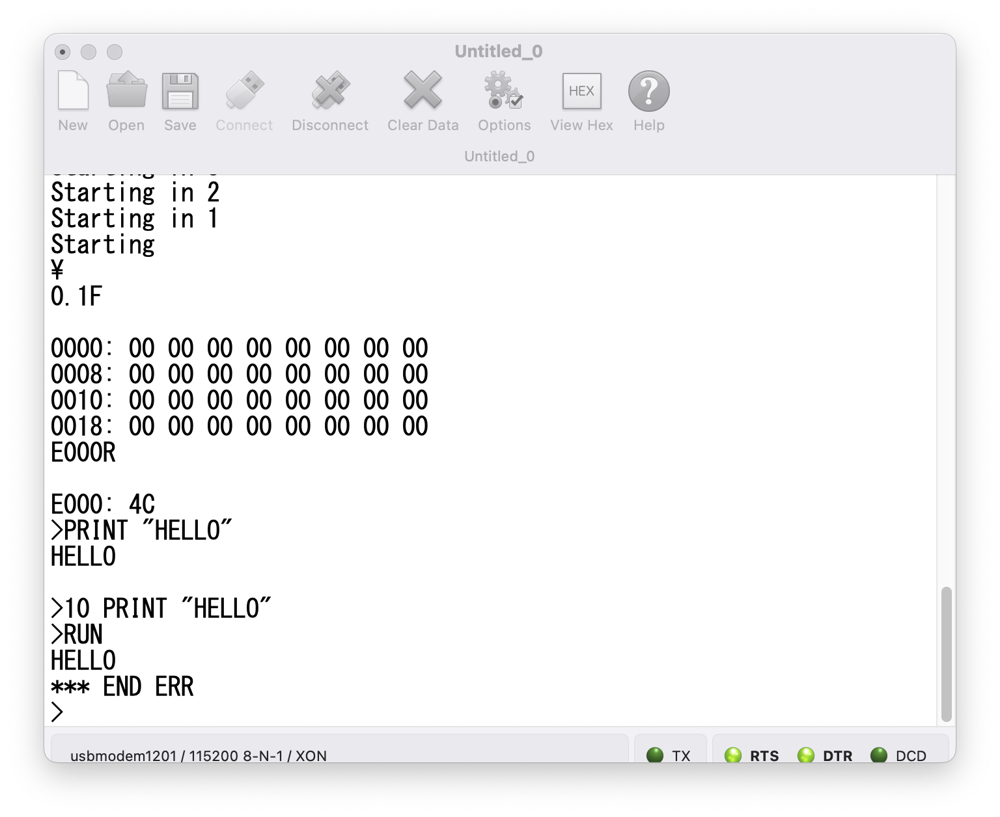

# PICO-6502-Apple1

This is an Apple1 emulator for [Raspberry Pi Pico](https://www.raspberrypi.org/products/raspberry-pi-pico/)

You can interact with it via its USB serial connection.

This is fork from [PICO-6502(dev branch)](https://github.com/DonaldMoran/pico-6502), which is a fork from [PICO-6502](https://github.com/jfoucher/pico-6502)

